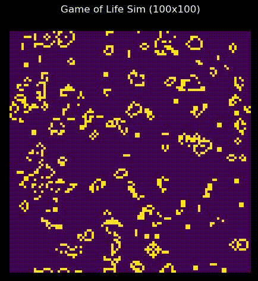

# Conway_GoL
## A Python Matplotlib implementation of Conway's game of Life.

This repo is an implementation of the conway's Game of Life zero-player game.
The world is designed in a toroidal topology i.e the edges are connected to satisfy
boundary conditions.

The arguments of this program are as follows:
```
optional arguments:
  -h,    --help         show this help message and exit
  -w     --init-world   Path to image file for world initialization
  -s     --world-size   Size of square canvas.
  -i     --interval     Interval between consecutive frames in ms.
```

Draw an Image in Paint in a NxN pixel canvas and see how it does as
an initial world!


